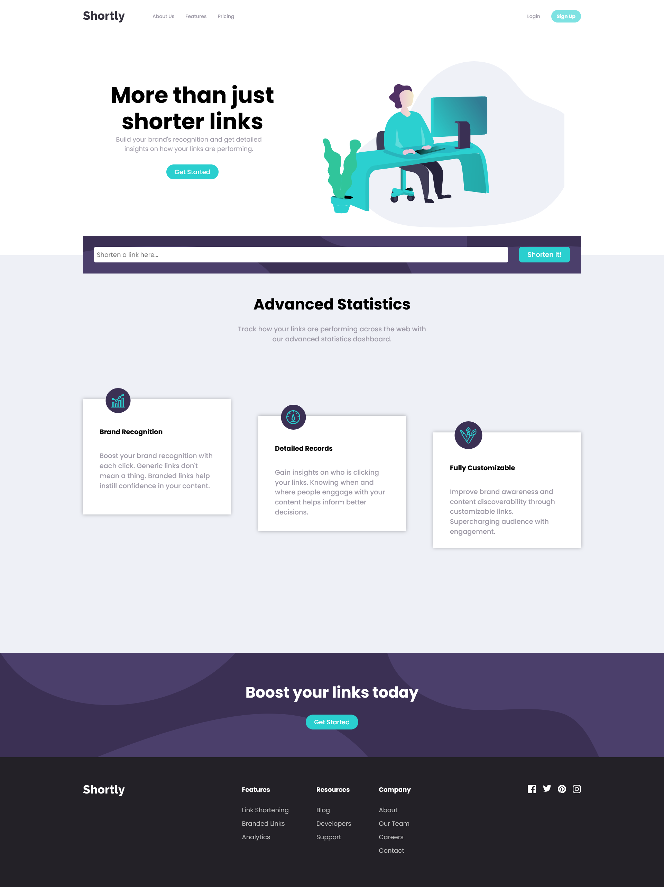
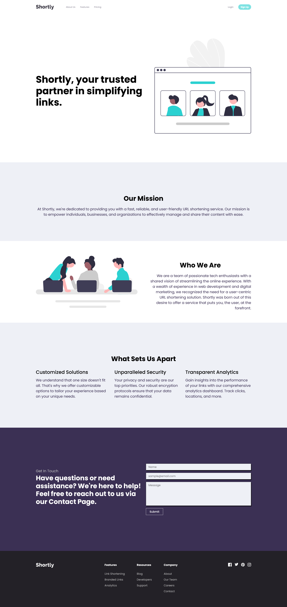
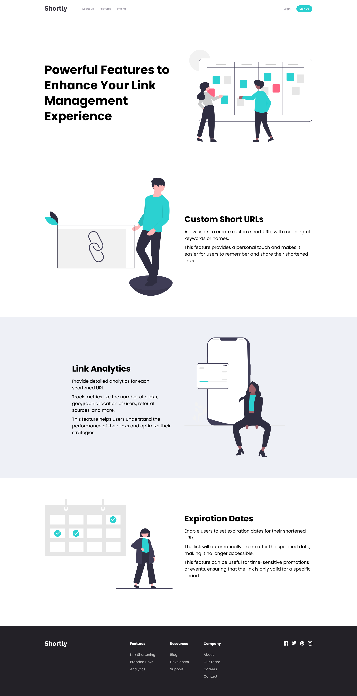
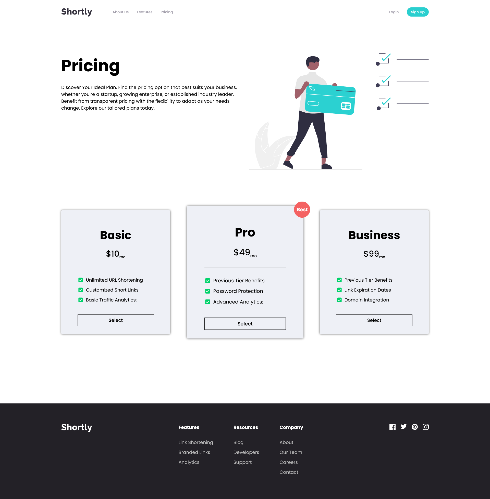
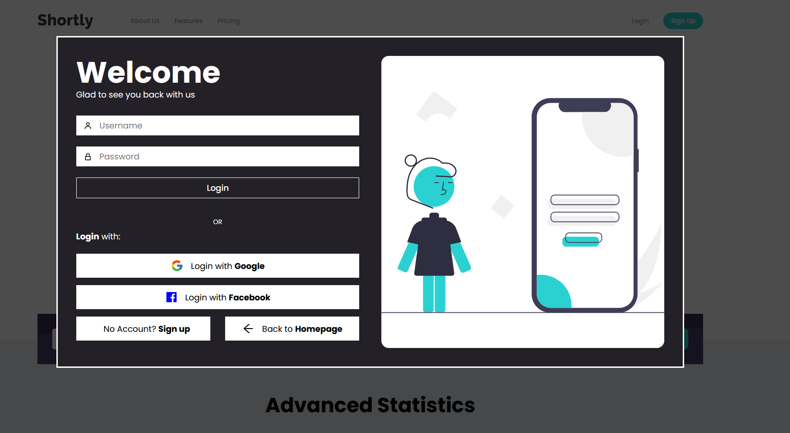
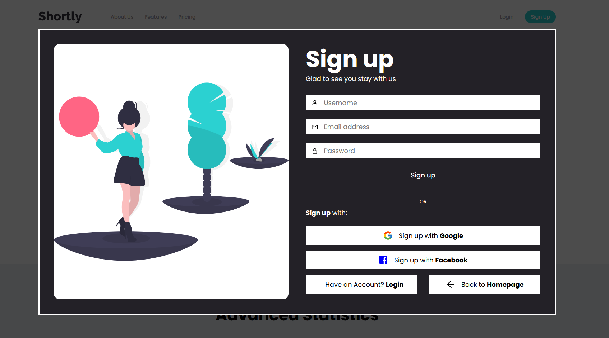

# Shortly

This is a solution to the [Url-shortening api landing page challenge on Frontend Mentor](https://www.frontendmentor.io/challenges/url-shortening-api-landing-page-2ce3ob-G).
## Table of contents

- [Overview](#overview)
  - [The challenge](#the-challenge)
  - [Screenshot](#screenshots)
- [My process](#my-process)
  - [Built with](#built-with)
  - [Useful resources](#useful-resources)
- [Author](#author)

## Overview
 - This project is a website for Shortly which offers url-shortening services.
 - Modifications were added to the project such as different hover and focus effects, layout, and such.
 - Contents and Routing for the three other pages as well as the login and signup form were also added to the project.

### The challenge

Users should be able to:

- View the optimal layout for the site depending on their device's screen size
- Visit the other pages for more information
- See hover states for all interactive elements on the page

### Screenshots

## My process
 - I initially started with the barebones of the site follwed by the routing of the other pages. After that was the styling of the homepage. Once I was done with the mobile layout,
 I proceeded to create the layout for the desktop view. Once I was done with the homepage, I went to the About page next doing the same process 'till I was done with the rest of the
 pages. Once the layouting was done, I then started doing the nav for mobile layout followed by its design. Once that was done, I did some minor refactoring followed by final checking.

### Built with

- Semantic HTML5 markup
- CSS custom properties
- Flexbox
- CSS Grid
- Mobile-first workflow
- [React](https://reactjs.org/)
- [SASS](https://sass-lang.com/guide/)
- [Undraw](https://undraw.co/search)
- [dribbble](https://dribbble.com)
- [react icons](https://react-icons.github.io/react-icons/#/)
- [google fonts](https://fonts.google.com/)

### Useful resources

- [mdn for css](https://developer.mozilla.org/en-US/docs/Web/CSS) - Helped me verify syntaxes that either I don't know or remember clearly.
- [w3Schools](https://www.w3schools.com/css/) - Similar purpose to mdn.
- [Undraw](https://undraw.co/search) - Most illustrations used in this project are taken from undraw.
- [About-template](https://dribbble.com/shots/22138254-Diamond-Buying-Platform) - Main layout inspiration for the About page
- [Features-template](https://dribbble.com/shots/9816066-NEW-S-App-Landing-Page-Design-Features) - Main inspiration for the Features page
- [Pricing-template](https://dribbble.com/shots/22615689-Daily-Challenge-Day-4-Pricing-page) - Main inspiration for the Pricing page
- [Login-and-Signup-Template](https://dribbble.com/shots/22689333-Minimal-Login-Page-UI-Design) - Main inspiration for the Login and Signup form
- [stackoverflow] - Used to get ideas.

## Author

- Website - TBA
- Frontend Mentor - [@rttn-Mango](https://www.frontendmentor.io/profile/rttn-Mango)
